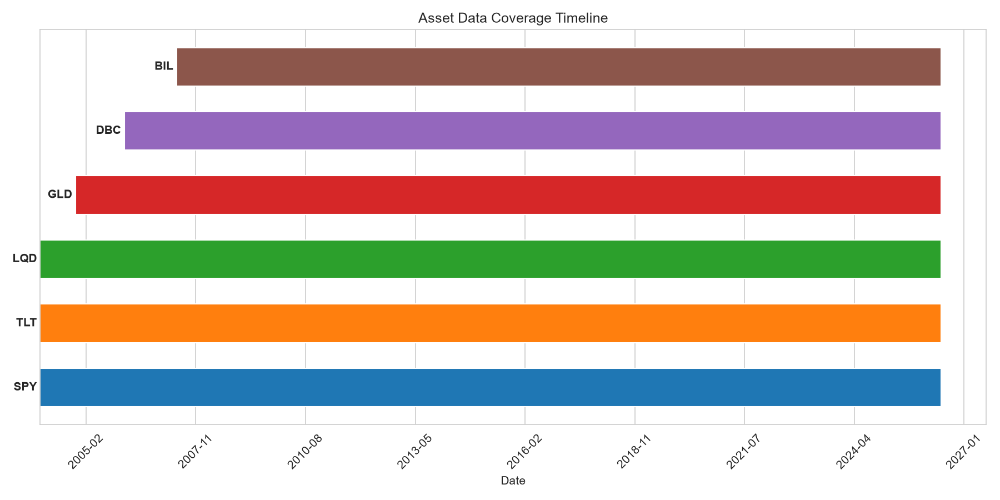
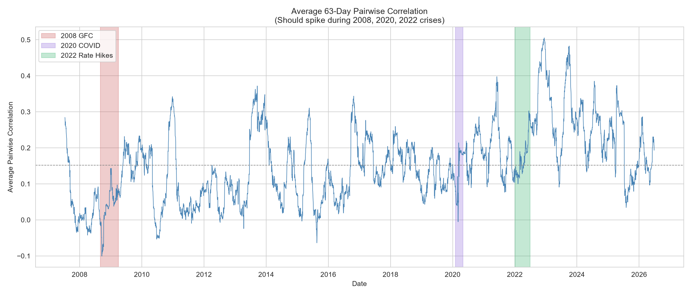
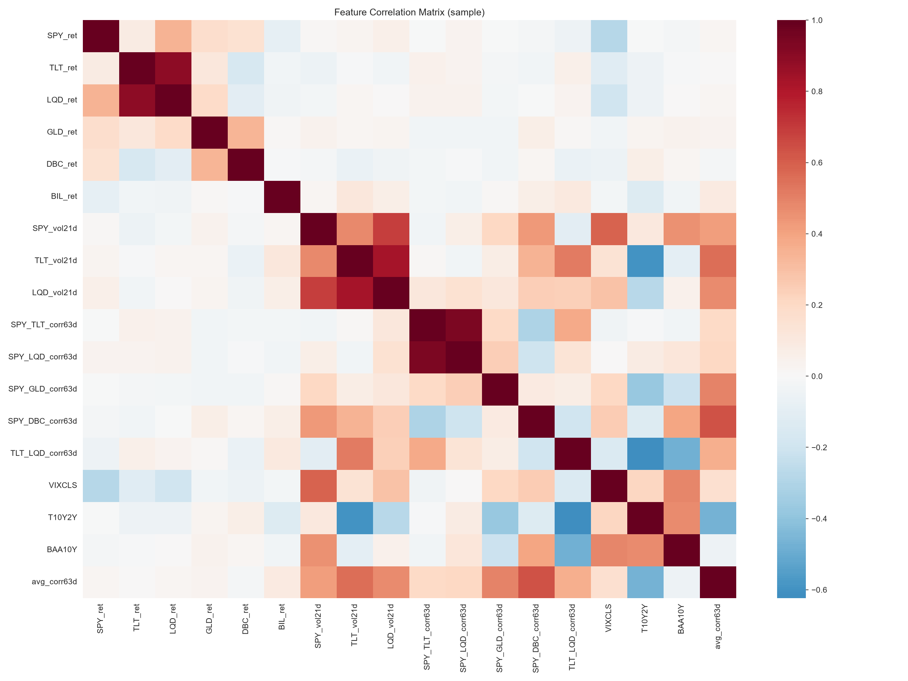

# Data pipeline QA report

Generated: 2026-06-28T19:54:44.373725

## Summary

- Pipeline status: complete
- Common coverage: 2007-05-30 to 2026-06-26 (6967 calendar days)
- Trading days: 4799
- Features: 39
- Assets: 6

## Asset availability

BIL is the binding constraint (inception around May 2007), so the full six-asset
panel is only complete from mid-2007. That window still spans the 2008 GFC, the
2020 COVID crash, and the 2022 rate-hike period.

| Ticker | First Date | Last Date | Trading Days | Coverage % |
|--------|------------|-----------|--------------|------------|
| SPY | 2004-01-02 | 2026-06-26 | 5656 | 100.0% |
| TLT | 2004-01-02 | 2026-06-26 | 5656 | 100.0% |
| LQD | 2004-01-02 | 2026-06-26 | 5656 | 100.0% |
| GLD | 2004-11-18 | 2026-06-26 | 5434 | 96.1% |
| DBC | 2006-02-06 | 2026-06-26 | 5129 | 90.7% |
| BIL | 2007-05-30 | 2026-06-26 | 4800 | 84.9% |

Common coverage start date: 2007-05-30

## Missingness

| Column | Valid Obs | Pre-Inception NaN | Post-Inception Gaps | Coverage % |
|--------|-----------|-------------------|---------------------|------------|
| SPY | 4800 | 0 | 0 | 100.0% |
| TLT | 4800 | 0 | 0 | 100.0% |
| LQD | 4800 | 0 | 0 | 100.0% |
| GLD | 4800 | 0 | 0 | 100.0% |
| DBC | 4800 | 0 | 0 | 100.0% |
| BIL | 4800 | 0 | 0 | 100.0% |
| VIXCLS | 4800 | 0 | 0 | 100.0% |
| T10Y2Y | 4800 | 0 | 0 | 100.0% |
| BAA10Y | 4800 | 0 | 0 | 100.0% |
| NFCI | 4692 | 2 | 102 | 97.9% |

## Summary statistics

### Returns

| Asset | Mean | Std Dev | Min | Max |
|-------|------|---------|-----|-----|
| SPY_ret | 0.000398 | 0.0125 | -0.1159 | 0.1356 |
| TLT_ret | 0.000125 | 0.0096 | -0.0690 | 0.0725 |
| LQD_ret | 0.000163 | 0.0056 | -0.0955 | 0.0932 |
| GLD_ret | 0.000365 | 0.0114 | -0.1084 | 0.1070 |
| DBC_ret | 0.000054 | 0.0122 | -0.0828 | 0.0665 |
| BIL_ret | 0.000054 | 0.0003 | -0.0039 | 0.0043 |

### Correlations

- Mean average correlation: 0.1520
- Std dev: 0.1049
- Min: -0.1008
- Max: 0.5052 (reached during crisis periods)

If the project's premise holds, average correlation should rise during the
2008, 2020, and 2022 stress periods as diversification breaks down. This series
is one way to check that.

## Figures

## Data quality checks

- [x] No negative or zero prices
- [x] No duplicate dates in any series
- [x] Monotonically increasing date index
- [x] All dates are valid NYSE trading days
- [x] Pre-inception NaNs preserved (not forward-filled)
- [x] Macro data forward-filled with staleness limit

## Known limitations

1. FRED vintage data: latest-vintage values, not point-in-time. ALFRED serves
   vintage data if point-in-time accuracy is needed.

2. ETF inception: full six-asset coverage only from mid-2007 because of BIL.
   Earlier dates have fewer assets.

3. Adjusted prices: yfinance auto_adjust=True handles splits and dividends.
   This is standard, though it does revise historical prices slightly.
